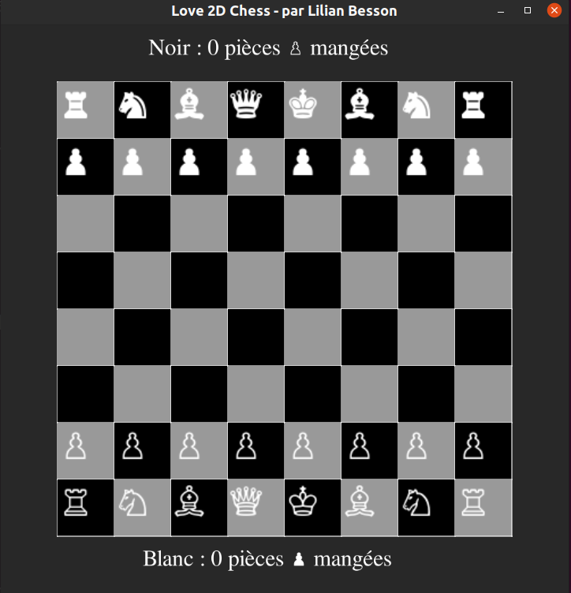
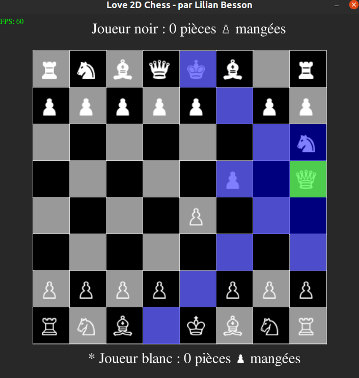

# Love-2D-tiny-Chess-game

Un petit jeu d'échec écrit en Lua avec le framework Löve2D (<https://love2d.org>).
Ce mini projet m'a permis de progresser en Lua et en Löve2D, dans le cadre des ateliers de programmation que j'anime au printemps 2023 à la Ludothèque et au Fablab de Briançon (voir [cette page](https://github.com/aucoindujeu/codeclub)).

## Avancement du mini projet

- [x] Première architecture avec des classes pour les pièces ;
- [x] Affichage du plateau ;

- [x] Calcul des coups possibles pour chaque type de pièces ;
- [x] Sélection de la pièce à jouer, et de la case de destination ;
- [x] Pouvoir manger une pièce adverse, compter +1 au score, et passer au joueur adverse ;
- [x] Alternance joueur blanc, joueur noir, etc. (machine à état basique) ;
- [x] Jeu infini, jusqu'à ce qu'un Roi ait été pris ;
- [x] l'interface graphique montre de façon très basique l'alternance des joueurs ;
- [x] Faire une version web, avec [`love.js`](https://github.com/Davidobot/love.js), et [publier la page web ici](https://naereen.github.io/Love-2D-tiny-Chess-game/www/) ;
- [x] Le plateau affiche les coordonnées sous forme A..H x 1..8 sur les côtés du plateau ;
- [ ] TODO: #1 faire en sorte que le joueur actif ne puisse bouger que ses pièces ;
- [ ] TODO: #2 quitter joliment, avec un message à l'écran, mais pour l'instant j'ai eu la flemme (+ je sais pas trop comment faire ça proprement) ;

Et après, je veux essayer ça :

- [ ] Connecter le joueur noir à une API en ligne de commande d'un bon solveur d'échec, par exemple d'abord [sunfish.lua](https://github.com/soumith/sunfish.lua) puis le champion [stockfish](https://stockfishchess.org/).
    * Pour commencer, on peut se contenter d'afficher à gauche du plateau une suggestion de coup à jouer, et laisser le joueur humain placer ce coup à la souris.

## Ce que je ne ferai pas tout seul (car j'ai pas envie)

Mais on peut essayer de le faire ensemble durant un des ateliers de programmation du mercredi après-midi !

- [ ] [La promotion des pions ?](https://fr.wikipedia.org/wiki/Promotion_(%C3%A9checs)) ;
- [ ] [Prises en passant](https://fr.wikipedia.org/wiki/Prise_en_passant) ;
- [ ] [Les petit et grand roques](https://fr.wikipedia.org/wiki/Roque_(%C3%A9checs)) ;
- [ ] Une intelligence artificielle faite maison ;

## License ?

[MIT Licensed](LICENSE)
© Lilian Besson (Naereen), 2023
